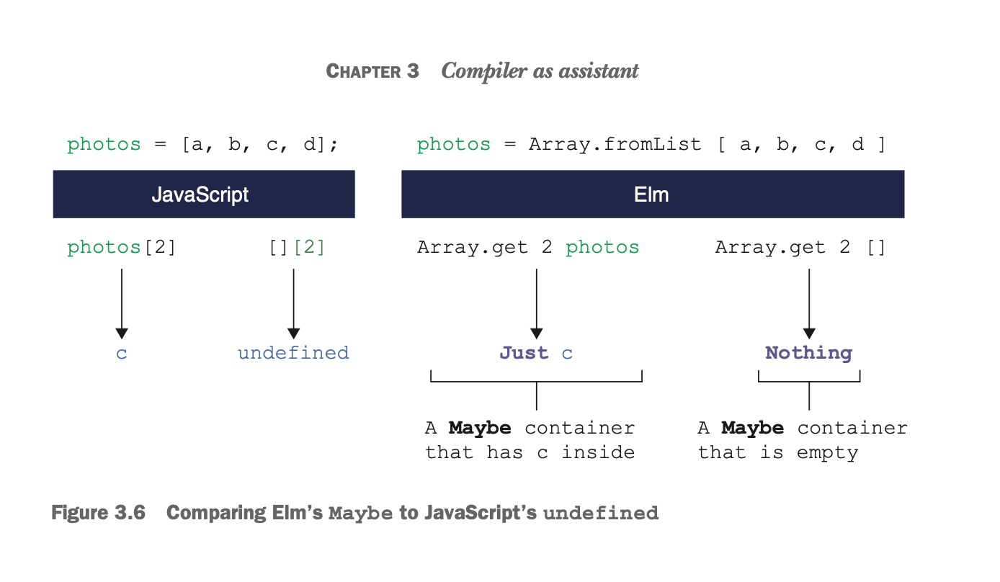

# Elm in Action - Notes:

## Page summaries:

- p. 8 : Strong type system, also for operators (+ for numbers, ++ for strings)

### Conventions:

- Double Quotes are for strings, single quotes are for utf-8 characters aka "chars"
- p. 10:
  - all letters in a naming should be uninterrupted
  - camelCase is preferred
- p. 31: use the direct element function, instead of `node` whenever possible
- p. 33: commas for a multiline literal in Elm should be in front of the next line, not the last as in js
  - this is due to the fact, that it would be still valid, but a wrong number of arguments
  - this guideline can help to reduce those errors
- p. 37: Don't expose everything from a module to your file, only if it's something like the `Html`module, which is meant to resemble Html-Markup
- p. 76: Don't use the default operator `_ -> something` in case expressions if not completely necessary. Like that you make sure the compiler can help in case the code is missing some type / case handling
- p. 96: If a function is ignoring a value or it's not used, it can be dropped/ignored as it is done it Golang by using an underscore for the value, e.g.:
```elm
_ = generateValue() -- the value is not used
```

### Expressions:

- p. 10: "An expression is anything that evaluates to a single value."
  - Everything in Elm is mostly an expression. It's the basic building block: especially functions consist of expressions
  - The classic `if{...} else{} ` from js is not an expression, the ternary is one, because it evaluates to a single value
    - `if` in Elm is used therefore in "if-Expressions", rather then "if-Statements"
    - example:
    ```elm
        elfLabel v = if v == 1 then "elf" else "elves"
    ```
    - The `else` part is mandatory(!) in Elm: p. 12
- p. 11: `!==` is `/=` in the Elm world, `!something` is `not(something)`
- p. 65f: Elm has beside the `if/else` pattern, also a pattern, which is pretty similar to "switch" statements in js, e.g.:

  ```elm
   type SomeType
    = Foo
    | Bar
    | Baz

   parseArgument : SomeType -> String
   parseArgument someType =
    case argument of
      Foo -> "return something"
      Bar -> "return also something"
      _ -> "return something if nothing is matching"
  ```

  - The cool thing about this pattern is: You always need to return for every possible case, that means you almost always need a default return case, which is expressed by `_-> `. This means, you can always be sure to cover every case.
  - There are no "break" commands, and also no fall-through like in js.
  - If you listed are possible arguments like so, you don't need to specify a default return. Elm knows in this case already that you have only three possible cases defined by the custom type, which tells elm that all cases are covered.

  ```elm
     parseArgument someType =
      case argument of
        Foo -> "return something"
        Bar -> "return also something"
        Baz -> "return something too"
  ```

### Functions:

- p. 13: A function represents re-usable logic in Elm. It has no fields and nothing to store, it only accepts values in form of arguments and returns a value
- p. 14: no return value for functions, because Elm only has a function body in form of an expression aka "evaluates to a single value"

  - --> no early returns as we know them from js!

  ```js
      function capitalize(str) {
      if (!str) {
          return str; }
          Early return
          return str[0].toUpperCase() + str.slice(1);
      }

      // the elm way would be --->

      function capitalize(str) {
          return !str ? str : str[0].toUpperCase() + str.slice(1);
      }

  ```

- p. 15: Spaces are right, tabs are an error in Elm
- p. 16: There are no methods or fields on values like on "string" in js, e.g. : `value.toString()`
- p. 18: **High Order Function** : A function, that accepts other functions as arguments, like `String.filter [function argument] --> filtered output`
- p. 18: **Let Expression** : A way of scoping values, methods, etc. to one function. It's wrapped inside like that:

  ```elm
      withoutDashes str =
          let
              dash =
                  '-'

              isKeepable character =
                  character /= dash
          in
          String.filter isKeepable str
  ```

- p. 19: _ Anonymous Functions _ : no name, begin with `\`, use `->` instead if `=`, e.g.: `\w h -> w * h`
  - especially useful as an argument to other functions, e.g. the string filter function
- p. 47: Functions in Elm are _curied_ by default. This means: They accept less then the specified arguments, because they return a new function which will then accept the next argument, and so on.
  - In js something like this would be done by doing:
    ```js
    function splitA(sep) {
        return function(str) {
            return str.split(sep); }
        }
    }
    ```
  - In Elm you would write something like this:
  ```elm
  List.map (\photo -> viewThumbnail model.selectedUrl photo) model.photos
  --- can be written like this:
  List.map (viewThumbnail model.selectedUrl) model.photos
  ```
  - The general rule of thumb is, something like:
  ```elm
  (\foo -> bar baz foo) -- can always be re-written to:
  (bar baz)
  ```
- p. 78: Functions in Elm are always returning the same defined result. So something like a "random" function like in Javascript does not work directly out of the box.

### Commands:

- p. 79: Commands are a value, which describes an operation to Elms runtime. The outputs can vary, which is the opposite to the way functions do work in Elm.
- Commands are not instant calls, as it would be the case with functions. You _declare_ that you would like to have one, which is then handled via the update function as it is done with evens like `onClick` and others.
- p. 82: Commands are always run after the view function, when the update function is also updating the model at the same time as a command is fired
- p. 83: The only _two places to run Commands_ are in `update` or `init`

### Operators:

- p. 20: Operators are nothing else then functions in Elm, the only accept exactly two arguments, aka they compare two values
  - usually we write operators in "infix-style", aka `value [operator] value`, but you can also write it in "prefix-style"
  ```elm
      7 - 4 == 3 --- returns True
      (-) 7 4 == 3 --- also returns True
  ```
  ```bash
    > (-)
     <function> : number -> number -> number
  ```
- p. 94f.: the `<|` operator is used to call a function. It can be used to pass in a function to another function in a cleaner way by dropping the parentheses


### Collections aka data structures:

- p. 22: Elm has basic collections in form of lists, records and tuples, **they are always immutable**
  - **Lists** in Elm consist of values of the same type, they have no methods, they can vary in size
    - this is true for almost all collections, it allows predictability and safer code
    - they resemble as the immutable version of javascript arrays
    - there are multiple functions to work with lists, e.g there is `List.filter ` or `List.map`
      - p. 45: `List.map` is almost the same as in js, just with another syntax which seems a bit weird at first:
      ```elm
          collection = List.map (\item -> doSomething arg1 arg2 etc) items
          -- the first argument is the function which specifies how the mapping over each item should be performed
          -- the second argument is the list collection, you want to iterate over
      ```
    - p. 98: The `a :: b` pattern gives you the first element of a list and the rest of the list as two arguments. This way, you can describe for example that a function expects to get a non empty list by providing at least one element of this list. E.g. a list of photos would be: `firstPhoto :: otherPhotos` 

- p. 24f.:
  - **Records** is a collection of fixed named fields with their values of varying type

    - fields can not be added or removed
    - they are the "objects from javascript" in Elm, e.g.

    ```elm
        { name = "Li", cats = 2 } -- they use "=" as delimiter, instead of ":" in js
    ```

    - as usual: they are immutable, modifying them is only possible through "record updates"

      - it works almost like the "spread operator" in js, the syntax is:

      ```elm
          myObject = { name = "User", likes = 2 }
          myUpdatedObject = { myObject | likes = 3 } -- increment likes with new value
      ```

    - they are basically only "key:value storage", no fancy js magic around like `Object.keys({...})`

- p. 26:
  - **Tuples** it's a collection with of values with (potentially) different types
  - max 3 values, mostly common are two value pairs, like `("key", "value")`
  - e.g.
  ```elm
      myTuple = ("name", 2, "whatever")
  ```
  - tuples are not a function, even if they have brackets when deconstructing: "Comma means tuple!"

### Types:

- p. 58: Types are tightly coupled to Elm. You generally can and should annotate your code by using them

  - Annotations are always have to appear on top of the declaration of something, e.g.:

  ```elm
  url : String
  url = "test" -- a number like '2' or something else would fail here

  isEmpty : String -> Bool -- functions use an arrow to differentiate inputs from outputs
  isEmpty str = str == ""

  ```

- p. 59: Types can be a variable. This allows to place a type definition as a placeholder. Type variables always need to start lowercase. This differentiates them from _concrete types_, e.g.: `String`
  - That's particular useful for expressing a function that accepts something of a type returns something of exactly that type, e.g.:
  ```elm
  fromList : List elementType -> Array elementType -- returns an array representation of the given list
  --- which could be used to realize both:
  fromList : List String -> Array String
  -- or
  fromList : List Float -> Array Float
  ```
- p. 61: Types can have alias. That means you define basically a type, which you can then use in different parts of your code to refer to exactly that type.

```elm
type alias Photo : { url : String }
```

- p. 64: If a function has multiple arguments, you need to type it in the way that elm will call this function, aka they are curried by default (!)

  - This means Elm will always treat a function that way, that it can also be just partially applied, e.g.:

  ```elm
  sayHello : String -> String -> String
  sayHello firstName lastName = "Hello" ++ firstName ++ " " ++ lastName

  --- partially applied:
  sayHello "Michael"
  > String -> String -- aka one String to go to return the final String
  ```

  - Elm is therefore technically only calling functions, which take one argument at a time

- p. 67f.: Enums are called **Custom Types** in Elm. Like that it can be specified which values a type can contain
  - They are defined like this:
  ```elm
  type SomeType
    = Foo
    | Bar
    | Baz
  ```
  - But compared to Typescript these are "real" types and not just a bunch of integers or strings under the hood
  - custom types are unique and comparing them will only match if you have exactly two of the same type, because they are "real" new types, it is also why they are written in capital letters --> in fact the booleans in Elm are exactly that: a custom type consisting of the two values:
  ```elm
  type Bool  = True | False
  ```
  - p. 70: Sadly you it's not possible to iterate over custom types, like it is possible in typescript with enums using the magic of `Object.values(...)`, see also this [post from stackoverflow](https://stackoverflow.com/questions/38132338/is-it-possible-to-iterate-over-union-type-in-elm)
- p. 71: In Elm there is no such thing as `undefined` or `null` (! :) )
  - There is a special custom type for it, describing if something is empty or not found:
  ```elm
  type Maybe value
    = Just value -- if a value was found (it's actually a function under the hood which returns a value of type "Maybe")
    | Nothing -- if nothing was found aka "null" or "undefined" Nothing is a value of type "Maybe"
  ```
  - compared with js it looks like so: 
  - p. 72: this also shows: Types can have a variable!
- p. 83: `()`: This thing is called a _unit_ and it is both: a value and a type.
  - p. 85: it can be replaced by another type, so it can only satisfied by using exactly this type, because the only value of `()` is `()`
  - with functions that takes this type as an argument, it is described that they always return exactly the same (which makes sense, because with `()` there is nothing inside which is "variable" and could change the input to the function)
  - using it inside a Program type declaration like so:
  ```elm
  Program : () Model Msg -- args are "Flags" "Type of Model" "Type of Msg"
  ```
  means that this is a program, which does not accept any flags currently

### Page rendering in Elm:

- p. 31: In Elm you don't write markup, you call functions (what else?), which create the DOM representations for you.
  ```elm
  -- creating a DOM node with elm, using the "node" function:
      node "button" [class "funky", id "submitter"] [text "Submit"]
  --  js would be something like: node function( arg1: string,   [argList of functions],  [argList2 of functions] )
  ```
  - the `Html` module in Elm is exporting these functions, it's also possible to drop the "node" in front of it, because the module is also providing convenience methods, that let you call the element function directly, e.g. calling
  ```elm
      button [class "someClass"] [text "Click me"]
  --  it's always function([list_of_attribute_functions], [list_of_children])
  ```

### The Elm Runtime:

- p. 39: the code from elm, which runs in the background to enable application state, event listening, scheduling Dom updates, etc.
- p. 40: [Elm Architecture](./assets/Elm_Architecture_Diagramm.png)
- p. 41: **State** in Elm is stored inside "Model"
  - the "View" function should base it's return values on the "model" (mode, view, controller?)
  - p. 48: state is modified through the "update" function.
- p. 49: **Update Function**:
  - The update function needs always to return a "fresh" model. This means if nothing was updated, it should just return "model" on it's own, even if it's the same as before.
  - The update function processes "messages", which were sent. Messages are values which are passed between systems
  - After the update function has run, the view returns always a fresh html (!=DOM is not re-created, like in React and other frameworks)
- p. 50f.: The _Browser_ module is the module which is needed to create an interactive application. It's describing too the elm runtime how the view (=html) looks like and how to deal with events via update(=processes the messages and updates the elm state if needed).
- p. 53: The **View** function is the place where the html is defined (like the render function in React)

## Screenshots:

- the compiler is your [best friend](./assets/nice_elm_compiler_message.png)
